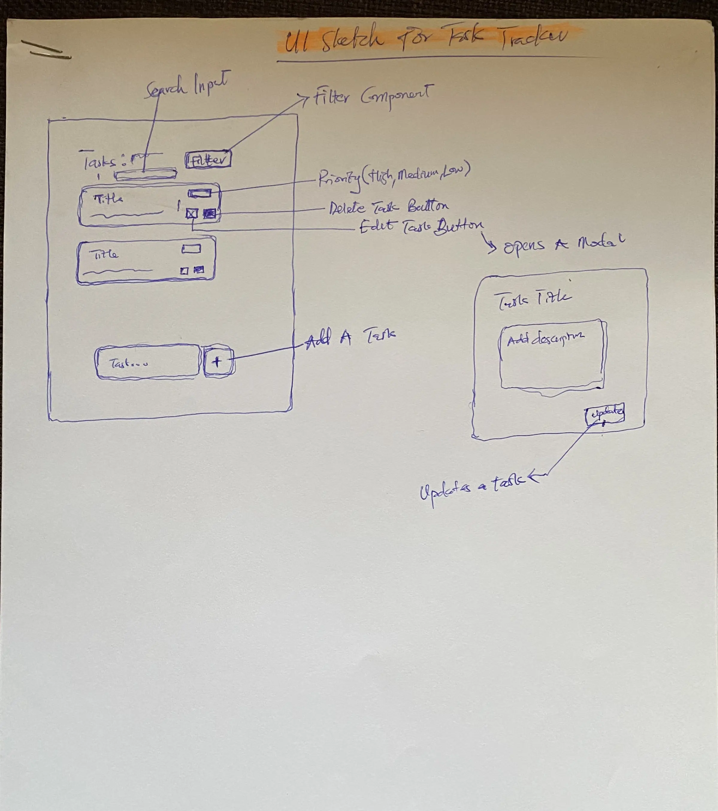
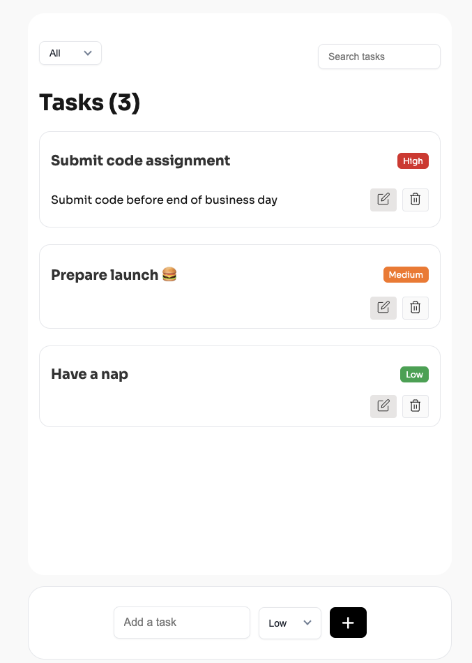
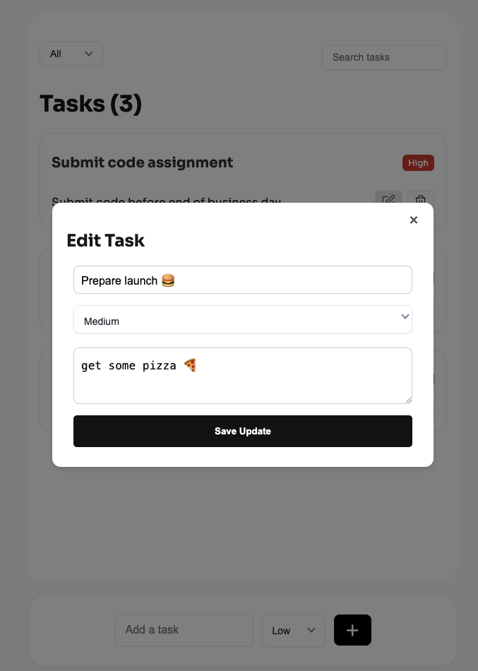

# Task Tracker

A task tracker app with priority filter.

Live Link: [task-tracker-vi.vercel.app](https://task-tracker-vi.vercel.app/)

## 📌 Table of Contents

- [🚀 Getting Started](#-getting-started)
- [🛠️ Tech Stack](#-tech-stack)
- [✅ Prerequisites](#-prerequisites)
- [📦 Installing](#-installing)
- [💻 Running the Application](#-running-the-application)
- [🧪 Running the Tests](#-running-the-tests)
- [📋 Approach](#-approach)
- [📸 Screenshots](#-screenshots)
- [🚀 Deployment](#-deployment)
- [👤 Author](#-author)

## 🚀 Getting Started

This project is built with [Vite](https://vite.dev/) and requires Node.js 18+ or 20+. Follow the steps below to set up and run the project.

## 🛠️ Tech Stack

- ReactJs: to build ui components
- Typescript: for type checkings
- CSS Modules: for styling
- Vitest & React Testing Library: for unit testing ui components

## ✅ Prerequisites

Ensure you have the following installed:

- **Node.js** (v18+ or v20) -> [Download Here](https://nodejs.org/en)
- **npm** (comes with Node.js)
- your favourite **text editor**

## 📦 Installing

Clone the repository and install dependencies:

```sh
git clone https://github.com/victorbruce/task-tracker
cd task-tracker
npm install
```

## 💻 Running the Application

To start the development server:

```sh
npm run build
```

## 🧪 Running the Tests

To run unit and component tests:

```sh
npm run test
```

## 📋 Approach

1. **Setup proper code formatting and commit message style**

   - Configured **ESLint** and **Prettier** for consistent code formatting.
   - Added **Commitlint** to enforce commit message conventions.

2. **Add Vitest and React Testing Library to test UI Components**

   - Installed **Vitest** and **React Testing Library** for unit and component testing.
   - Wrote a **sample test** to verify the setup.

3. **Setup Continuous Integration with GitHub Actions**

   - Configured **GitHub Actions** to run automated checks when a **pull request** is made to the `main` branch.
   - Added **dependency caching** to improve CI performance.

4. **Update Docs**

   - Next, I updated the docs to include how to run the project including tests.

5. **Come up with a sketch to implement**

   - I quickly came up with a rough sketch of how I will want the application to look, and feel.

   

6. **Implement a good enough UI**

   - I quickly developed a good enough UI and rendered static data and also unit test ui components

7. **Implement all features**

   - I then implemented the features required step by step whiles refactoring and expanding tests

8. **Refactor code and ui**
   - Lastly, I refactored the code and also improved the UI ensuring it's accessible across all the major devices.

## 📸 Screenshots




## 🚀 Deployment

To deploy the project:

```sh
npm run build
```

Then, follow the hosting provider's guide to deploy the `dist` folder (e.g. Vercel, Netlify)

## 👤 Author

Victor Bruce

[Github](https://github.com/victorbruce) | [LinkedIn](https://www.linkedin.com/in/victor-bruce/)
